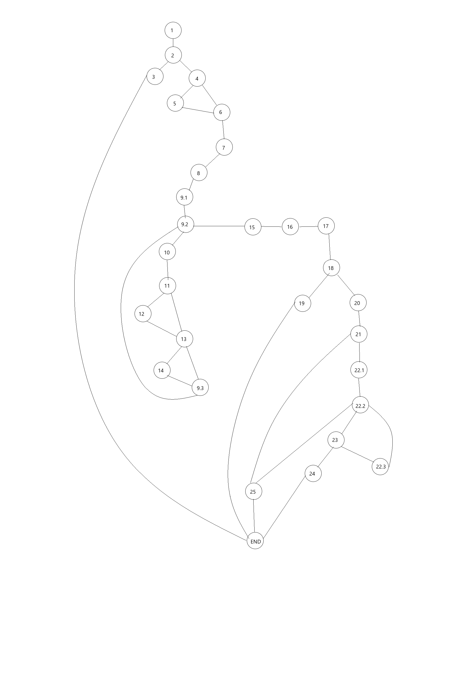

# Никола Петрушев 216140

## Control flow graph

## Цикломатска комплексност

Има повеќе начини за пресметка на цикломатската комплексност. Еден од тие начин е со броење на предикатни јазли (P) + 1. Во нашиот случај P=10, 10 + 1 = 11, од што следи дека цикломатската комплексност е 11.

## Every Branch Тест случаи

Потребни ни се 4 тест случаи за да ги опфатиме сите ребра (every branch). Тие се:
`{User user, List<User> users}`

- Случај каде што user == null => `{null, []}`

- Случај каде што  username == null и email не содржи @ . => `{(null, "password", "nikola at mail com"), []}`

- Случај каде што password е подолг од 8 карактери и содржи специјален карактер и email содржи @ . Во првата итерација на for циклусот, password и email не се совпаѓаат, додека во втората се совпаѓаат, и password е помал од 8 карактери => `{("nikola", "pas##", "nikola@mail.com"), [("nikola", "neSeSovpagja", "mailNeEIsti@mail.com")("nikola", "pas##", "nikola@mail.com")]}`

- Случај каде password содржи празно место => `{("nikola", "pass word##", "nikola@mail.com"), [("nikola", "password##", "nikola@mail.com")]}`

## Multiple Condition Тест случаи
`if (user==null || user.getPassword()==null || user.getEmail()==null).`

Потребни ни се 4 тест случаи:
- Случај каде што user==null 

`user = null`
- Случај каде што user!=null && user.getPassword()==null 

`user = ("charshav", null, null)`
- Случај каде што user!=null && user.getPassword()!=null && user.getEmail()==null 

`user = ("charshav", "p@ssword4e", null)`
- Случај каде што user!=null && user.getPassword()!=null && user.getEmail()!=null

`user = ("charshav", "p@ssword4e", "nikola@mail.com")`

